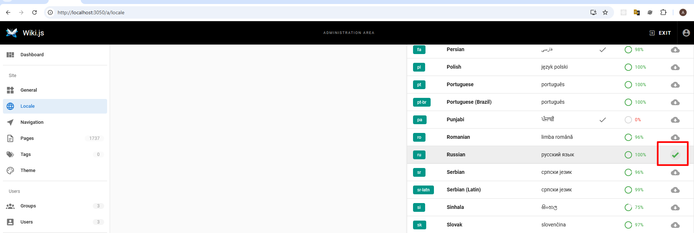
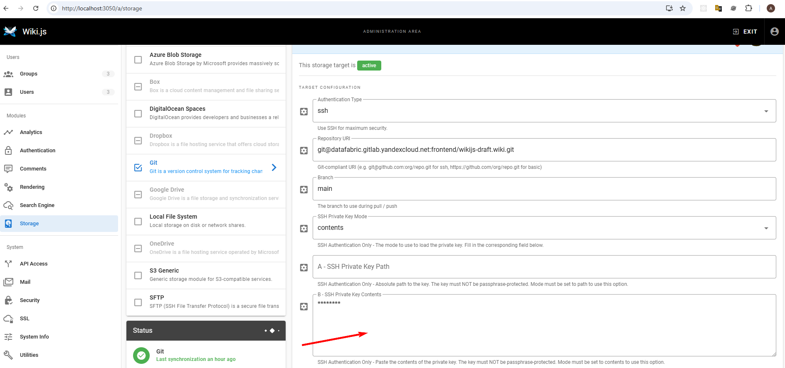
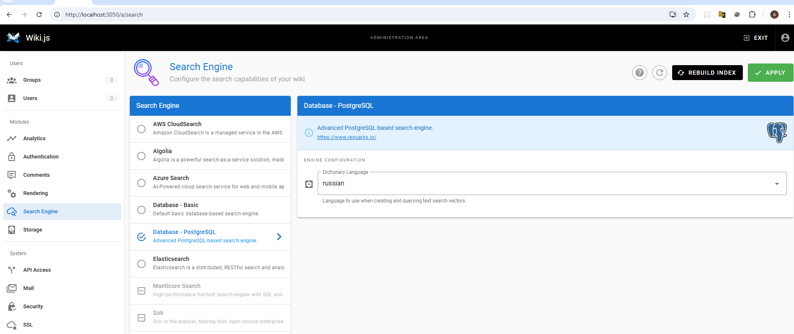

## Запуск
```
docker compose up -d
```

## Включение русского языка




Созданные страницы перестают быть видны.
Видимо, страницы привязаны к языку.
Нужно сначала изменить язык а потом создавать/загружать страницы
Не пробовал.
Вернул English.

## Интеграция с gitlab


вставил содержимое C:\\Users\\andre\\.ssh\\id_rsa

По умолчанию интеграция работает в обе стороны.

## Настройка поиска



По умолчанию стоял basic
Не знаю, повлияло ли на что нибудь переключение на Database - PostgreSQL

## Разграничение доступа
- Группа


- Пользователь

